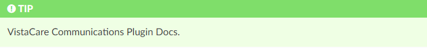
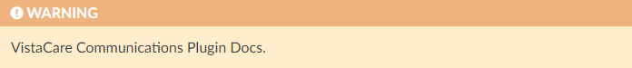
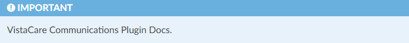

# Vistacare Communications Docs

This is the repository for the documentation of the developments builded on VistaCare Communications.

## Online Documentation

https://gentle-ground-0bd1c310f.3.azurestaticapps.net/

## Requirements installation

To install the Python requirements excecute the following command.

```python
pip install -r requirements.txt
```

***Remember be on the root folder of the documentation***

## Compile the documentation

To compile the documentation run the following command:

```bash
sphinx-build -b html ./docs ./docs/_build --keep-going --no-color -w /tmp/sphinx-log
```

***To visualize the documentation go to the folder _build and open the index.html on your Browser.***

## Style guide

1. Tip



```html
<div class="seealso">
<p class="admonition-title">TIP</p>
<p>VistaCare Communications Plugin Docs.</p>
</div>
```


2. Alert



```html
<div class="warning">
<p class="admonition-title">WARNING</p>
<p>VistaCare Communications Plugin Docs.</p>
</div>
```

3. Important



 ```html
<div class="note">
<p class="admonition-title">IMPORTANT</p>
<p>VistaCare Communications Plugin Docs.</p>
</div>
```

4. Images

It is necessary to use PNG to shows the functionality to the user.

The following code shows the GIF in the correct format on the documentation:

```html
<a class="" data-lightbox="QGIS Install" href="_static/install_qgis.gif" title="QGIS Install" data-title="QGIS Install">
</a>
```

5. Videos

The videos should be added with the following code:

```html
<a data-fancybox="QGIS Project Files - User Side" href="../../_static/viewers/qgis_project_files_admin_side.mp4" data-caption="QGIS Project Files - User Side">
  
</a>
```

<div class="note">
<p class="admonition-title">IMPORTANT</p>
<p>It is necessary generate a Thumbnail, to do it please excuse the following command.</p>
<code>
ffmpeg -i qgis_project_files_admin_side.mp4 -i play_icon.png -ss 00:00:02 -vframes 1 -filter_complex "[1:v]scale=200:-1[play_scaled];[0:v][play_scaled]overlay=(W-w)/2:(H-h)/2" -q:v 2 qgis_project_files_admin_side_thumbnail.jpg
</code>
<br>
<p>The play_icon.ong image can be found on .docs/_static/resources</p>
</div>

### Recommended parameters:

<div class="seealso">
<p class="admonition-title">TIP</p>
<ul>
  <li>Resolution: 1920 x 1080</li>
  <li>Format: .mp4</li>
</ul>
</div>

### Recommended software:

<div class="seealso">
<p class="admonition-title">TIP</p>
<ul>
  <li>Record screen: <a href="https://obsproject.com/">OBS</a></li>
  <li>Edit video: <a href="https://www.shotcut.org/">Shotcut</a></li>
</ul>
</div>
