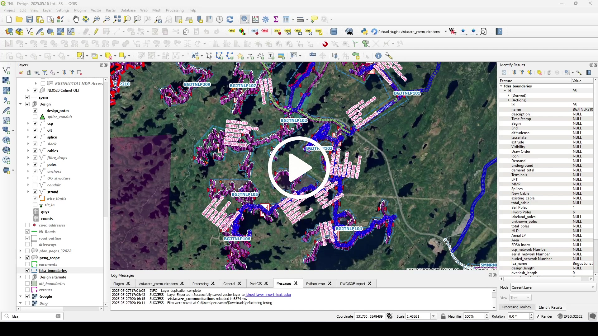

# Database

## Database Functions

This module integrates with database and provides a user friendly interface to perform database functions tasks.

IMPORTANT

Make sure to load your project file you're working on.

The following steps will allow you to execute `Database Functions`:

1. **Initiate with Spatial Data Selection:** From the Layers interface, select a relevant layer as the input for your desired database function. This initial step is crucial as it sets the context for the operation, requiring you to open the attribute table of the chosen layer to pinpoint the specific data you wish to manipulate or analyze. 

2. **Navigate to Database Functions:** On VistaCare plugin, navigate to `Database --> Database Function` menu.

3. **Authenticate Database Access:** Fill in your database credentials (`USERNAME`,`PASSWORD`).

4. **Function Selection:** Select a database function from the table that suit your needs.
   
5. **Parameter Configuration and Feature Selection:** Layer is pre-set with layer selected from interface. 
   Selected Feature table will be filled with features selected from the attribute table from `item1`. 
   From Function Parameters dropdown menu, select the `field` to be used as input parameter for the database function.

6. **Output Directory (Optional):** You have the option to select a directory where the resultant files will be saved. The default directory is at `C:\\Users\\{USERNAME}\\Documents`
   
7. **Execution:** Click `Run` triggers evaluation and execution of the database function. 

 

TIP

Cables and Strand Construction Notes Guide

| Project   | Layer Table to Use | Field Name |
| --------- | ------------------ | ---------- |
| NL Xplore | fdsa_boundaries    | name       |
   