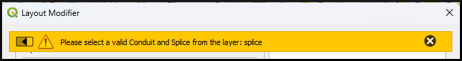

# Layout

## Layout Modifier

The Layout modifier module allows us to modify the page's Layer and the Layout for the Atlas configuration to exchange the Layers IDs and the Layour components between each field selected.

The following steps will allow you to execute the Layout Modifier functionality:

1. On the VistaCare Communications Plugin go to `Tools --> Layout Modifier`.
2. Fill the following options:

    * Layout: Layout to be modified.
    * Page Layer: Layer that is used to create the Atlas.
    * Field Page Layer: The field that is used to order the pages on the Atlas.
    * Initial ID: the ID that will be migrated.
    * Final ID: the Target ID to be replaced.

3. Click on `OK` and wait until the module finishes the execution. 

## Conduit and splice

The `Conduit and splice` allows the user to create diagrams on the QGIS Layout based on the conduit, splice and conduit connection layers.

WARNING

When you run the functionality Conduit and Splice it is necessary to select the splices to be drawn, if you do not select the splice you will obtain the following message.

The following steps will allow you to execute the Conduit and splice functionality:

1. On the VistaCare Communications Plugin go to `Layout --> Conduit and splice`.
2. Fill the options available for each case:

    * Layout: Choose one of the Layouts create on the QGIS Projects.
    * Splice layer: Information Point type Layer with the Splice database structure.
    * Conduit connections layer: Alphanumeric type Layer with the Conduit connection database structure.
    * Conduit layer: Line type Layer with the Conduit database structure.

3. Click on `OK` and wait until the module finishes the execution. 
4. Click on `Close` and review the results on the Layout edited.

## Conduit relations creator

The `Conduit relations creator` allows the user to create connections between conduits based on the id and the size of the conduit related.

The following steps will allow you to execute the Conduit and splice functionality:

1. On the VistaCare Communications Plugin go to `Layout --> Conduit Relations Creator`.
2. Fill the options available for each case:
    
    * Conduit connections layer: Alphanumeric type Layer with the Conduit connection database structure.
    * Conduit layer: Line type Layer with the Conduit database structure.
    * Splice layer: Information Point type Layer with the Splice database structure.
    * Select a Splice: Click and choose from the interface the splice that intersects the conduits involved in the relation to be created.
    * Init Conduit ID: Choose one of the IDs options displayed on the interface as initial conduit ID.
    * End Conduit ID: Choose one of the IDs options displayed on the interface as Final conduit ID.

3. Click on `OK` and wait until the module finishes the execution. 
4. Click on `Close` and review the results on the Conduit connections layer.

