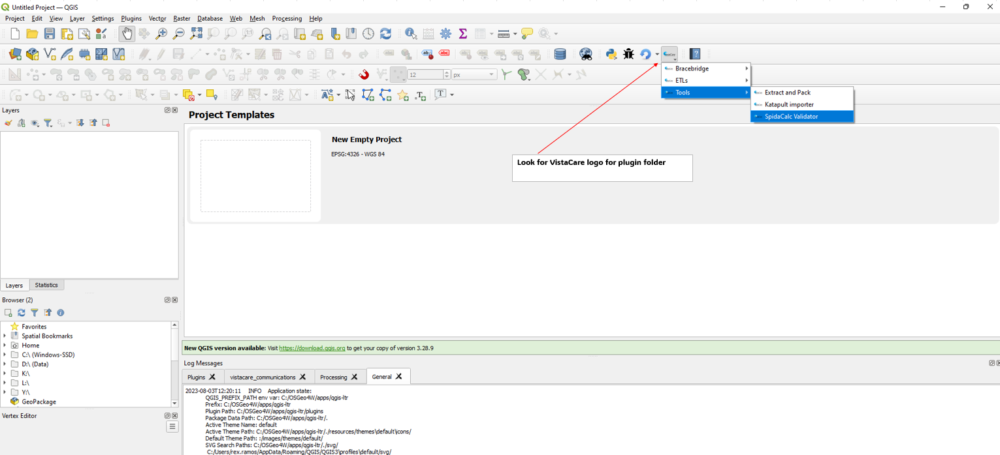
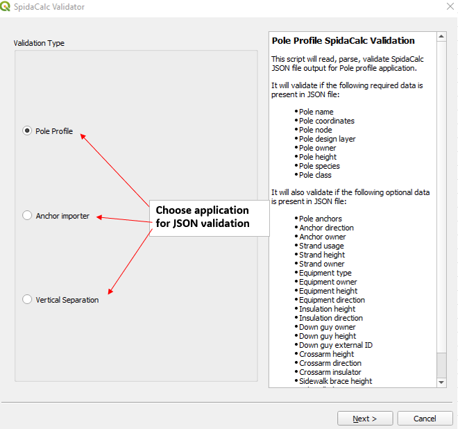
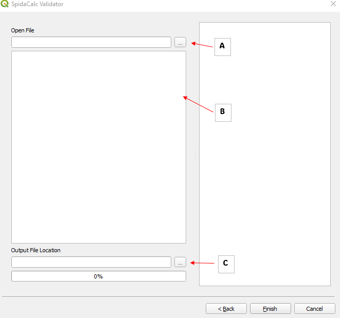
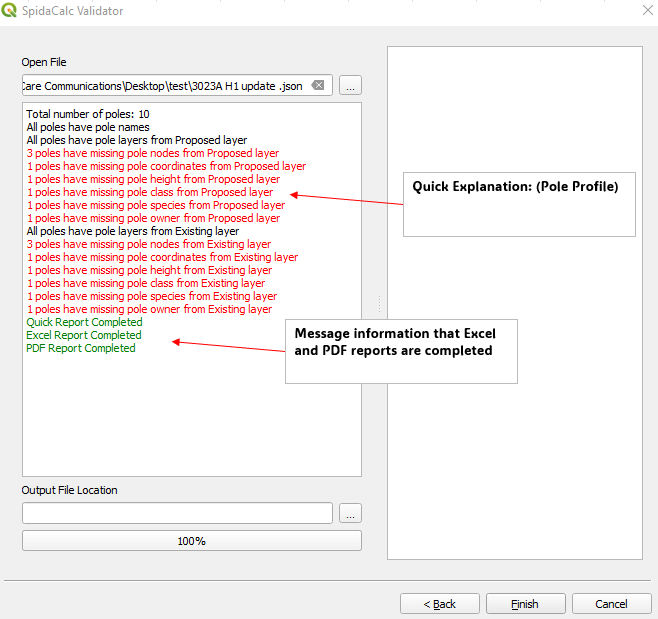

# Tools

## Extract and Pack

The Extract and Pack module as the name implies filters the selected layers by the feature in the boundary layer, extracts the information with the methods *intersect* or *within* and packs this data on a specific folder defined by the user.

The following steps will allow you to execute the Extract and Pack functionality:

1. On the VistaCare Plugin go to `Tools --> Extract and Pack`.
2. Fill the following options:

    * Boundary Layer: A Polygon layer with the features will be used as a boundary.
    * Boundary Feature: Define the feature that will be the borders of the information extracted.
    * Layers to Extract: Choose all the layers that are required to be exported.
    * Selection Type: Select one option to match the information (Intersect or Within).
    * Folder for export: Choose the place where they will be located the information extracted.

3. Click on `OK` and wait until the module finishes the execution. 

## Katapult Importer

The Katapult module allow the user to transfor and load  information from Katapult to the database. this operation is soported for *Poles, Anchors, Civics, Spans*.

The following steps will allow you to execute the Katapult Importer functionality:

1. On the VistaCare Plugin go to `Tools --> Katapult Importer`.
2. Choose the project where you want to import the data.
3. Choose which kind of Layer are you going to import (Anchors example).
4. Fill the options available for each Layer case (Anchors example):

    * Shapefile Anchors: Information extracted from Katapult that contain the Anchors data.
    * Shapefile Guys: Information extracted from Katapult that contain the Guys data.
    * Anchors: Anchors Layer with the database structure.
    * Guys: Guys Layer with the database structure.

3. Click on `Import Data` and wait until the module finishes the execution. 
4. Click on `Finish`.

## SpidaCalc Validator

Plugin to extract information from SPIDACALC JSON and generate PDF, XLS report for required missing information.

1. Access the plugins here: 
   
   

2. Choose application to validate SpidaCalc JSON file.
   * A.) Pole Profile
   * B.) Anchor Importer (SpidaCalc to DB)
   * C.) Vertical Separation
   * List will add up as we develop more plugins applications 

    

3. On user interface: 
   * A.) Input JSON file location. 
   * B.) Text box to show important messages
   * C.) **(Optional)** Output file location where reports are saved. If empty, reports generated will be saved to where input JSON file is located 

    

4. Brief Description in Text Box: 
   **JSON validation for Pole Profile Application**
   * Validated JSON file has 10 poles
   * 10 poles have pole names
   * 10 poles have proposed layer
   * *extracted information from PROPOSED Layer:*
     * 3 out of 10 poles have missing pole nodes (unique pole identifier in Katapult)
     * 1 out of 10 poles have missing pole coordinates (coordinates can be use to determine pole location in Katapult)
     * 1 out of 10 poles have missing pole height (information to calculate pole feature coordinates in pole)
     * 1 out of 10 poles have missing pole class
     * 1 out of 10 poles have missing pole species (information to determine pole material)
     * 1 out of 10 poles have missing pole owner (required information in pole profile)
   * *same information goes to EXISTING Layer*

    

IMPORTANT

Any specific information can be seen on both reports.

## Layout Modifier

The Layout modifier module allows us to modify the page's Layer and the Layout for the Atlas configuration to exchange the Layers IDs and the Layour components between each field selected.

The following steps will allow you to execute the Layout Modifier functionality:

1. On the VistaCare Plugin go to `Tools --> Layout Modifier`.
2. Fill the following options:

    * Layout: Layout to be modified.
    * Page Layer: Layer that is used to create the Atlas.
    * Field Page Layer: The field that is used to order the pages on the Atlas.
    * Initial ID: the ID that will be migrated.
    * Final ID: the Target ID to be replaced.

3. Click on `OK` and wait until the module finishes the execution. 

