# Tools

## Extract and Pack

The Extract and Pack module as the name implies filters the selected layers by the feature in the boundary layer, extracts the information with the methods *intersect* or *within* and packs this data on a specific folder defined by the user.

The following steps will allow you to execute the Extract and Pack functionality:

1. On the VistaCare Communications Plugin go to `Tools --> Extract and Pack`.
2. Fill the following options:

    * Boundary Layer: A Polygon layer with the features will be used as a boundary.
    * Boundary Feature: Define the feature that will be the borders of the information extracted.
    * Layers to Extract: Choose all the layers that are required to be exported.
    * Selection Type: Select one option to match the information (Intersect or Within).
    * Folder for export: Choose the place where they will be located the information extracted.

3. Click on `OK` and wait until the module finishes the execution. 

## Katapult Importer

The Katapult module allow the user to transfor and load  information from Katapult to the database. this operation is supported for *Poles, Anchors, Civics, Spans*.

The following steps will allow you to execute the Katapult Importer functionality:

1. On the VistaCare Communications Plugin go to `Tools --> Katapult Importer`.
2. Choose the project where you want to import the data.
3. Choose which kind of Layer are you going to import (Anchors example).
4. Fill the options available for each Layer case (Anchors example):

    * Shapefile Anchors: Information extracted from Katapult that contain the Anchors data.
    * Shapefile Guys: Information extracted from Katapult that contain the Guys data.
    * Anchors: Anchors Layer with the database structure.
    * Guys: Guys Layer with the database structure.

3. Click on `Import Data` and wait until the module finishes the execution. 
4. Click on `Finish`.

## SpidaCalc Validator

Plugin to extract information from SPIDACALC JSON and generate PDF, XLS report for required missing information.

The following steps will allow you to execute the SpidaCalc Validator functionality:

1. On the VistaCare Plugin go to `Tools --> SpidaCalc Validator`.
2. Choose application to validate SpidaCalc JSON file.

    * Pole Profile
    * Anchor Importer (SpidaCalc to DB)
    * Vertical Separation

3. On user interface, select JSON file to work on.
4. **(Optional)** Choose folder location you want to save your reports.
5. Click `OK` button to generate table

<a class="" data-lightbox="Spidacalc Validator" href="_static/spidacalc_validator_gif.gif" title="Spidacalc Validator" data-title="Spidacalc Validator">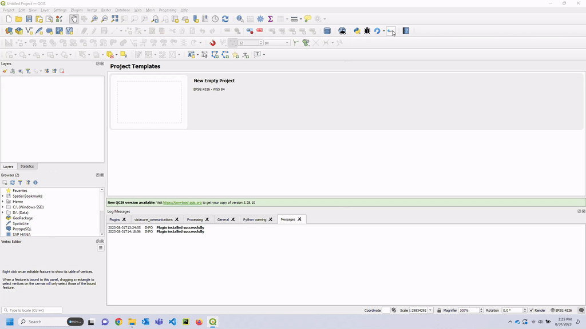
</a>

TIP

1. Brief Description in Text Box: 
   * Description in 'BLACK' font color are general information
   * Description in 'RED' font color are pole feature missing information
   * Description in 'GREEN' font color are completed reports
2. For **PDF report**, missing information from JSON or any other information source will have its value as `None` and font color to 'RED'.
3. For **XLS report**, missing information from JSON or any other information source will have a value of `None` and its cell font color to 'RED'. Also, if a layer is missing, rest of the row of layer and pole will be empty.

IMPORTANT

All the detailed information can be found in the generated reports.

## BOM Report

This plugin extract BOM and BOL information and generates a report in .xlxs format. 

The following steps will allow you to execute BOM Report functionality:

1. Open `fdsa_boundaries` attribute table and select fsa needed for BOM Report.
2. On the VistaCare Communications Plugin go to `Tools --> BOM Report`.
3. Fill in the drop down menu. Follow the table below for recommended menu and layer to select.
4. Select BOM template Excel file from directory.
5. **Optional** Select where to save the .xlxs file result
6. Click `OK`

TIP

BOM Report Dropdown menu and Layer Guide

| Drop down Menu                                               | **Layer Table to use**        |                                                                                                                                                                                                                              
| ------------------------------------------------------------ | ----------------------------- | 
| FSA Layer                                                    | fdsa_boundaries			   | 
| Splice Layer                                                 | splice                        |
| Poles Layer                                                  | poles                         |
| Cable Layer                                                  | cables                        |
| Conduit Layer                                                | conduit                       |
| UG Layer                                                     | UG_structure				   |
| Strand Layer												   | Strand			               |
| CSP Layer													   | csp						   |
| Anchor Layer												   | anchors					   |
| Guys Layer												   | guys						   |
| Peng Layer												   | peng_scope					   |
| Span Layer												   | spans						   |
| Slack Layer												   | slack 						   |
| Arbs														   | arbs_m						   |
| Wiring Limits												   | wire_limits				   |
| BOM Sheet Name											   | BOM-(with *BOM* keyword)	   |
| BOL Sheet Name											   | BOL-(with *BOL* keyword)	   |

### How it works

<a data-fancybox="BOM and BOL Report" href="_static/boms_report.mp4" data-caption="BOM and BOL Report">
  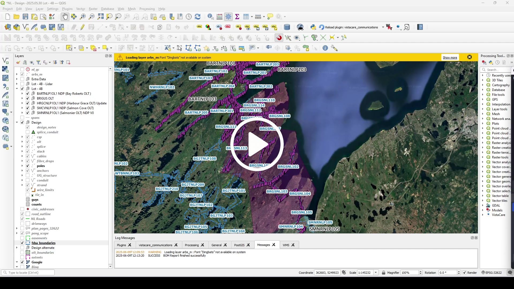
</a>
 

## Consumable List

This plugin extract BOM Consumable list and generates individual .xlxs per fsa selected.

The following steps will allow you to execute Consumable List functionality:

1. Open `fdsa_boundaries` attribute table and select fsa needed for Consumable List.
2. On the VistaCare Communications Plugin go to `Tools --> Consumable List`.
3. Fill in the drop down menu. Follow the table below for recommended menu and layer to select.
4. Select Consumable List template Excel file from directory.
5. **Optional** Select where to save the .xlxs file result
6. Click `OK`

TIP

Consumable List Dropdown menu and Layer Guide

| Drop down Menu                                               | **Layer Table to use**        |                                                                                                                                                                                                                       
| ------------------------------------------------------------ | ----------------------------- | 
| FSA Layer                                                    | fdsa_boundaries			   | 
| Splice Layer                                                 | splice                        |
| Poles Layer                                                  | poles                         |
| Cable Layer                                                  | cables                        |
| Conduit Layer                                                | conduit                       |
| UG Layer                                                     | UG_structure				   |
| Strand Layer												   | Strand			               |
| CSP Layer													   | csp						   |
| Anchor Layer												   | anchors					   |
| Guys Layer												   | guys						   |
| Peng Layer												   | peng_scope					   |
| Span Layer												   | spans						   |
| Slack Layer												   | slack 						   |
| Arbs														   | arbs_m						   |
| Sheet Name										           | Material Order Form    	   |

### How it works

<a data-fancybox="Consumable List BOM" href="_static/consumable_list.mp4" data-caption="Consumable List BOM">
  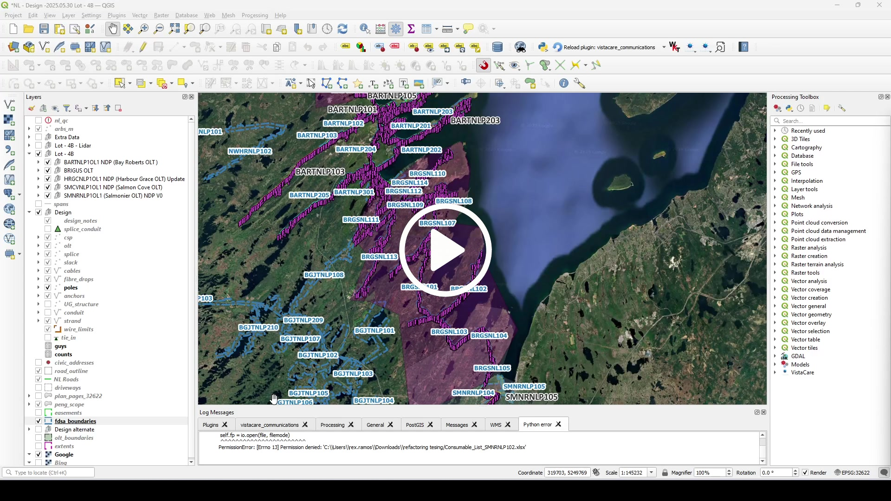
</a>
 

## Span Clearance And Vertical Separation

The Span Clearance And Vertical Separation module allows the user to obtain an Excel spreadsheet with the results of the Wire to Wire and To Ground Clearance process executed in SpidaCalc. Also is a CSV generator for P'Eng Report Exhibit 1 DESIGN DATA Vertical Separation (At Pole).

The following steps will allow you to execute the Span Clearance And Vertical Separation functionality:

1. On the VistaCare Communications Plugin go to `Tools --> Span Clearance And Vertical Separation`.
2. Select the JSON file to work on.
3. Tick the checkbox which pole you want to generate.
4. **(Optional)** Choose folder location you want to save the files.
5. Click `OK` button to generate table

### Span Clearance And Vertical Separation Errors

WARNING

When running the functionality Span Clearance And Vertical Separation, it is possible to obtain one of the following messages.

  
1. Bar message will show if wrong JSON file is used (non SpidaCalc json file). Make sure to use SpidaCalc generated JSON file.
  
<a class="" data-lightbox="Vertical Separation" href="_static/vertical_separation_img/vs_bar_msg_wrong_json_short.png" title="Wrong JSON file" data-title="Wrong JSON file">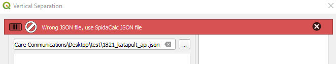
</a>

2. Bar message will show if `Proposed` layer has an issue and script will not proceed.

<a class="" data-lightbox="Vertical Separation" href="_static/vertical_separation_img/vs_bar_msg_layer_issue_short.png" title="Layer issue" data-title="Layer issue">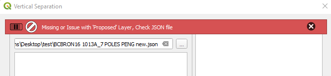
</a>

3. If selected pole was unable to extract information due to an error, it will display the pole and its error in the textbox. A hyperlink of the output will be displayed in the textbox.

<a class="" data-lightbox="Vertical Separation" href="_static/vertical_separation_img/vs_textbox_information.png" title="Textbox information" data-title="Textbox information">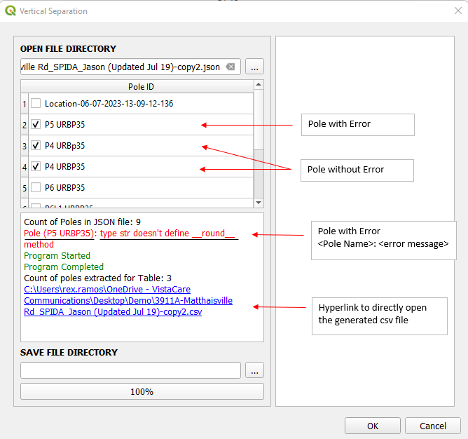

## Pole Profile

IMPORTANT

If output folder location is empty, output files will be save at input json folder location 

 
Image generator for Pole Profile P'Eng Reports. This plugin lets you create a 2D image for pole profile
in an SVG or DXF format. SVG format gives the user a scalable vector graphic that maintains high quality 
image and can be easily edited with various vector graphic software. DXF format provides compatibility 
with numerous CAD applications.

The following steps will allow you to execute Pole Profile

1. On the VistaCare Plugin go to `Bracebridge --> Pole Profile`.
2. Select the JSON file to work on.
3. Choose the pole profile format and pole profile file type. 
4. Tick the checkbox which pole you want to generate the profile.
5. Fill in Direction column for pole bearing with respect to roadside, default value is 0 degrees.
6. **(Optional)** Choose folder location you want to save your profiles.
7. Click `OK` button to generate the profiles.

TIP

When selecting both <code>XCI</code> and <code>DXF</code> formats along with multiple poles, the plugin performs the following actions:

<ul>
    <li>Generates a side-by-side image of the selected poles in a single AutoCAD file (named the same as the JSON file)</li>
    <li>Creates individual AutoCAD files for each selected pole (named based on the pole label)</li>
</ul>

Additionally, make sure to open the related QGS project file and select the <code>Poles</code> layer or a related layer from <code>Pole Information Source Layer</code> drop down to capture the table information accurately.

<a data-fancybox="Pole Profiles" href="_static/new_pole_profile.mp4" data-caption="Pole Profiles">
  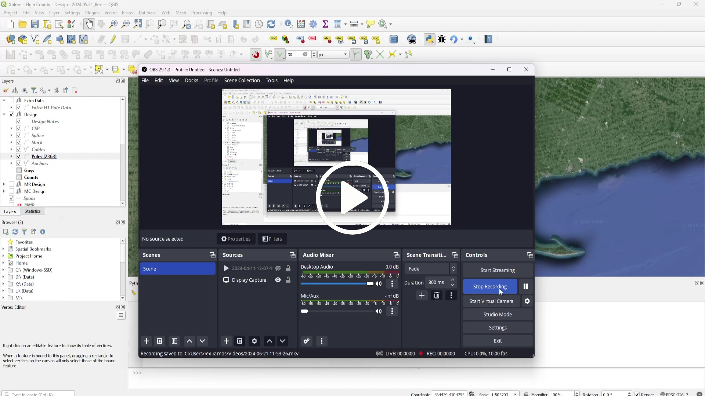
</a>
 

IMPORTANT

Format Summary Table

<!--Markdown Table Generator Data from https://tabletomarkdown.com/generate-markdown-table/ -->
| Display                                                | **H1 Format**                                                                                                                    | **Lakeland Format**                                                         | **XCI Format**                                                              |
| ------------------------------------------------------ | ---------------------------------------------------------------------------------------------------------------------------- | ----------------------------------------------------------------------- | ----------------------------------------------------------------------- |
| Font Color                                             | RED for MR changes on Hydro space Black on Telco space                                                                    | RED for MR changes on Hydro space Black on Telco space               | RED for MR changes on Hydro space Black on Telco space               |
| Primary wires                                          | All wires are drawn                                                                                                          | Lowest primary height is drawn                                          | Lowest primary height is drawn                                          |
| Primary wires with MR                                  | **'PRIM.'** will be in Bold, Red, **Original Value** in Bold, Red then **MR Value** in **'****()****'** ,Bold, Red | 'PRIM.' in Red Original value in Red then MR value in '()', Red   | 'PRIM.' in Red Original value in '()' and Red then MR value in Red   |
| Neutral/Sec wire                                       | All wires are drawn                                                                                                          | All wires are drawn                                                     | All wires are drawn                                                     |
| Neutral/Sec wire with MR                               | **'NEUT./SEC.'** in Bold, Red **Original Value** in Bold, Red **MR value** in **'****()****'**, Bold, Red          | 'NEUT./SEC.' in Red Original Value in Red MR value in '()', Red   | 'NEUT./SEC.' in  Red Original Value in '()', Red MR value in  Red |
| Proposed guys with Proposed Telco wire              | **'P.BELL/ P.D.G.'** in Bold                                                                                             | **'P.BELL/ P.D.G.'** in Bold                                        | **'P.XPLORE/ D.G.'** in Bold, Blue font color                                  |
| Proposed Telco wire and  proposed guy for represenation | Black Color \`DOT\`                                                                                                          | Black Color \`DOT\`                                                     | Blue Color \`DOT\`                                                      |
| Feature in new heights and Original height          | Original height in normal weight New height in '()' in normal weight                                                      | Original height in normal weight New height in '()' in normal weight | Original height in '()' New height in Normal weight               |
| New Feature height value display                       | **New height** in Bold                                                                                                       | **New height** in Bold                                                  | **New height** in Bold                                                  |
| Feature text display                                   | Display in upper case eg. TRANSF.                                                                                         | Display in upper case eg. TRANSF.                                    | Display in upper case eg. TRANSF.                                    |
| Feature height value display                           | Height Value in normal weight                                                                                                | Height Value in normal weight                                           | Height Value in normal weight                                           |

### Pole Profiles Errors

WARNING

When running the functionality Pole Profiles, it is possible to obtain one of the following messages.

1. Bar message will show if wrong JSON file is used (non SpidaCalc json file). Make sure to use SpidaCalc generated JSON file.

<a class="" data-lightbox="Pole Profile" href="_static/pole_profile_img/pp_bar_wrong_json_short.png" title="Wrong JSON file" data-title="Wrong JSON file">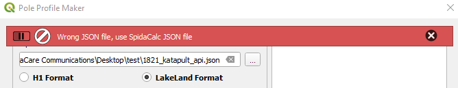
</a>

2. Bar message will show if JSON file has missing layers (`Existing` or `Proposed`) and script will not proceed.

<a class="" data-lightbox="Pole Profile" href="_static/pole_profile_img/pp_bar_missing_layer_short.png" title="Missing Layer" data-title="Missing Layer">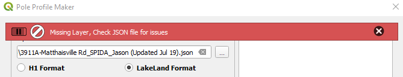
</a>

3. Bar message will show how many poles have error during populating table information after selecting JSON file(**A**). It will also specify the pole name with its error on the text box (**B**).

<a class="" data-lightbox="Pole Profile" href="_static/pole_profile_img/pp_exclude_poles_with_errors.png" title="Poles with errors" data-title="Poles with errors">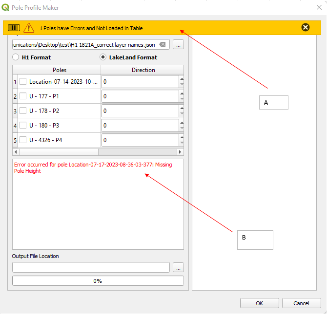
</a>

4. If any pole in the table have error during pole profile creation, it will specify the pole with its error on the text box.

<a class="" data-lightbox="Pole Profile" href="_static/pole_profile_img/pp_error_during_generation.png" title="Errors during generation" data-title="Errors during generation">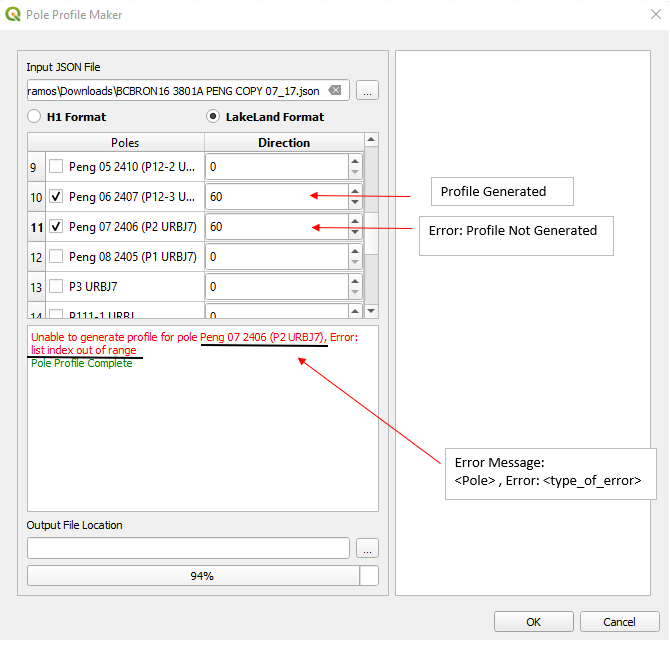
</a>

## PAR Profiles

This module, similar to `Pole Profile`, this allows users to generate pole profiles in DXF format, ensuring compatibility with numerous CAD applications. It works exclusively with SpidaCalc JSON files containing a single or double pole layer. If the pole has two layer, it will generate poles for both layers and won't do comparison for both layer unlike with `Pole Profiles`.

The following steps will allow you to execute PAR Profile.
1. In the VistaCare Communications Plugin go to `Tools --> PAR Profiles`.
2. Select the JSON file to work on.
3. Tick the tickbox which pole you want to generate the profile.
4. Fill in Direction column for pole bearing with respect to roadside, default value is 0 degrees.
5. **(Optional)** Choose folder location you want to save your profiles.
6. Click `OK` button to generate the profiles.

<a data-fancybox="PAR Profiles" href="_static/PAR_profile.mp4" data-caption="PAR Profiles">
  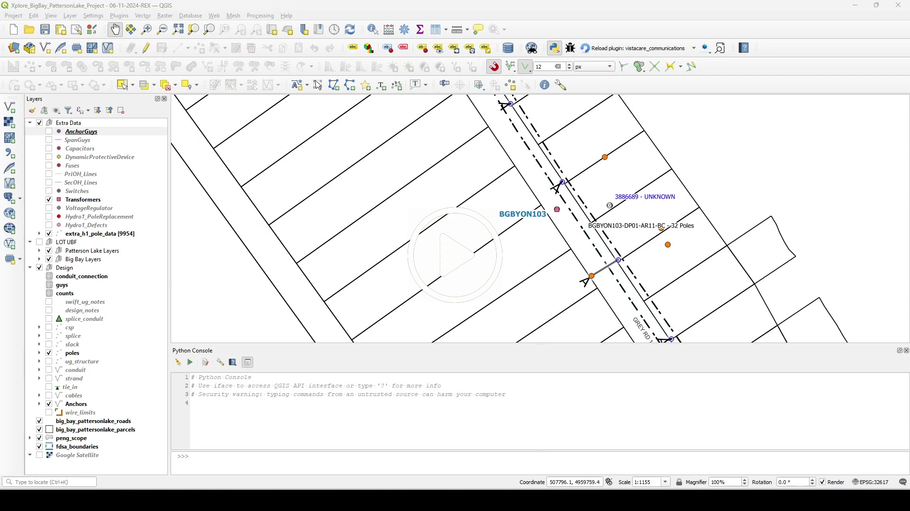
</a>
 

TIP

The plugin performs the following actions:

<ul>
    <li>Generates a side-by-side image of the selected poles in a single AutoCAD file (named the same as the JSON file)</li>
    <li>Creates individual AutoCAD files for each selected pole (pole label), if two layer exist for the pole it will name as (pole label_layer name)</li>
</ul>

Additionally, make sure to open the related QGS project file and select the <code>Poles</code> layer or a related layer from <code>Pole Information Source Layer</code> drop down to capture the table information accurately.

## Katapult Profiles

Similar with `Pole Profiles` and `PAR Profiles`, this module allows the user to generate a CAD format pole profiles using the information from Katapult. The module interface allows the user to choose some or all of poles to be generated. This also has a search bar wherein the user can narrow down the poles from the table.

The following steps will allow you to generate pole profiles using Katapult:
1. In the VistaCare Communications Plugin go to `Tools --> Katapult Profiles`.
2. From browser, copy the Katapult job id and paste it in the line edit. 
   <a class="" data-lightbox="Katapult Profiles" href="_static/katapult_job_id.png" title="Katapult job id" data-title="Katapult job id">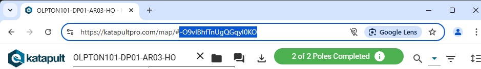
    </a>
3. Select the poles to be generated.
4. **(Optional)** Choose folder location you want to save your profiles. Default location is at C:/Users/{username}/Desktop/{Katapult Job Name}
5. Click `OK` button to generate the profiles.

### How it Works

<!--  -->

<a data-fancybox="Katapult Profiles" href="_static/katapult_profiles.mp4" data-caption="Katapult Profiles">
  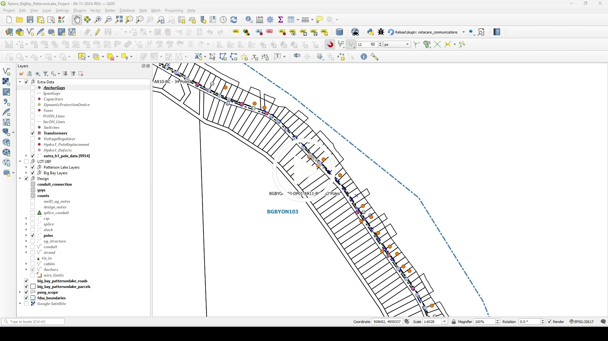
</a>
 

## Counts Calculator

TIP

Counts Calculator can be excecute from CSP or Splice layers

It uses a tree structure to traverse the nodes along the cable structure. As it moves through each node, it uses the *total_distribution_demand* variable to calculate the counts and update or create the necessary counts.

The following steps will allow you to execute the Counts Calculator functionality:

1. On the VistaCare Communications Plugin go to `Tools --> Counts Calculator`.
2. Fill the following options:

    * CSP Layer: A Point layer with the features will be used as a Start point.
    * Splice Layer: A Point layer with the features will be used as a Start point.
    * FSA Layer: A Polygon layer with the features will be used as a boundary.
    * Cables Layer: A Line layer with the features will be used as a network.
    * Counts Layer: A Text layer where it is going to be storage the information calculated.
    * Invert Start Cables: Radio button that allows to invert the start of the cables excecution.

3. Click on `Select a CSP` or `Select a Splice` to choose the feature where is going to start the calculation.

3. Click on `OK` and wait until the module finishes the execution. 

