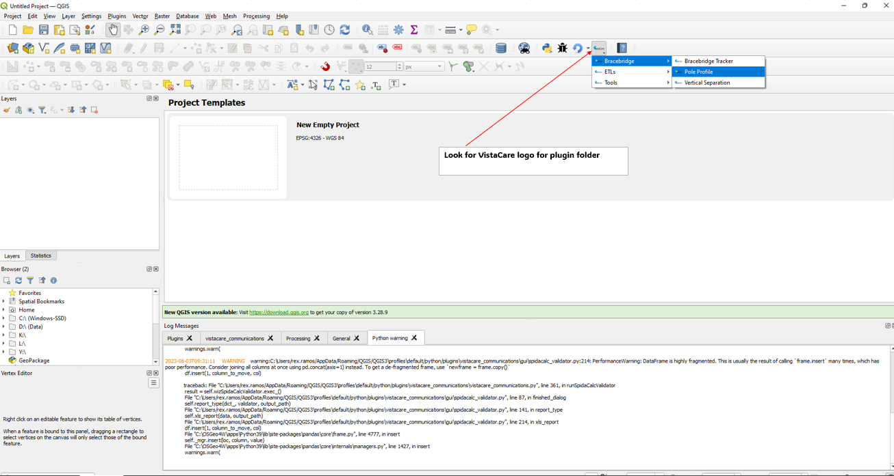
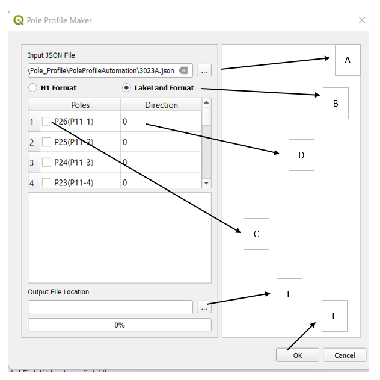
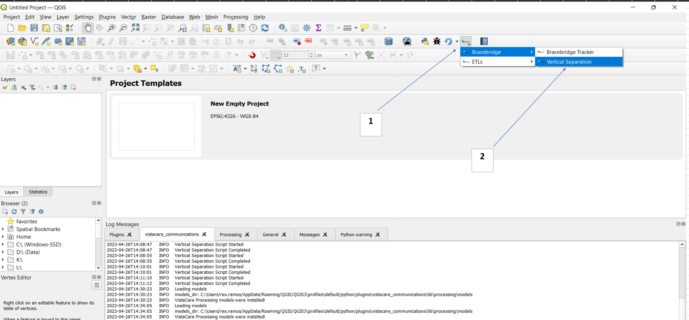
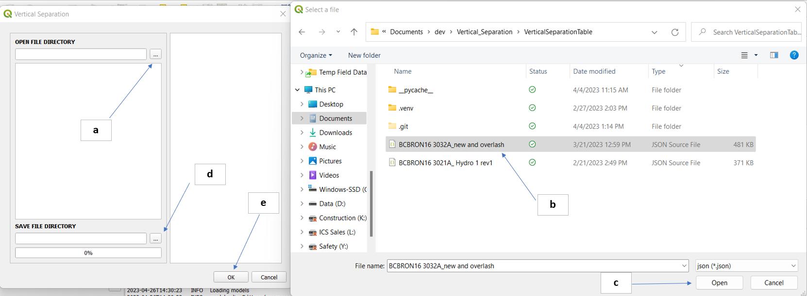

# Bracebridge

## Bracebridge Tracker

The Bracebridge Tracker module 

The following steps will allow you to execute the Bracebridge Tracker functionality:

1. On the VistaCare Plugin go to `Bracebridge --> Bracebridge Tracker`.
2. Fill the following options:

    * FSA Layer: FSA Layer with the database structure.
    * Plans Layer: Plans Layer with the database structure.
    * Cables Layer: Cables Layer with the database structure.
    * Conduit Layer: Conduit Layer with the database structure.
    * Fibre drops Layer: Fibre drops Layer with the database structure.
    * Splices Layer: Splices Layer with the database structure.
    * UG Structures Layer: UG Structures Layer with the database structure.
    * Strands Layer: Strands Layer with the database structure.
    * Anchors Layer: Anchors Layer with the database structure.
    * Poles Layer: Poles Layer with the database structure.
    * Folder for export: Choose the place where the excel file will be exported.

3. Click on `OK` and wait until the module finishes the execution. 

## Pole Profile

SVG 2D image generator for Pole Profile P'Eng Reports.

1. Open the plugin here:
   

2. On pole profile interface, the following can be done: 
  

   * A.) Select the JSON file to work on
   * B.) Choose which pole profile format to use
   * C.) Tick the checkbox which pole you want to generate the profile
   * D.) Pole bearing with respect to roadside, default value is 0 degrees
   * E.) **(Optional)** Folder location you want to save your profiles. If left blank, it will save to where the input JSON file is located at
   * F.) Click **OK** button to generate the profiles.

## Vertical Separation

CSV generator for P'Eng Report Exhibit 1 DESIGN DATA Vertical Separation (At Pole) 

2. Open the plugin here:
  

3. Open the JSON file
  
   * a. Open file directory
   * b. Select the JSON file
   * c. Click the Open Button
   * d. **(Optional)** Select the directory and file name to save the CSV file to be generated.
     *If Save File Directory was left empty, CSV generated file will be saved where
     JSON file is located at and with the same JSON file name*.
   * e. Once OK button is pressed, script will run 