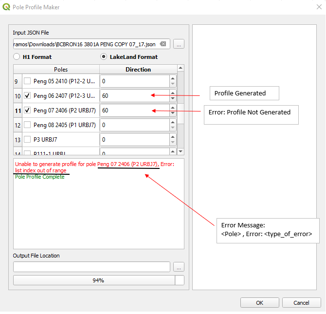
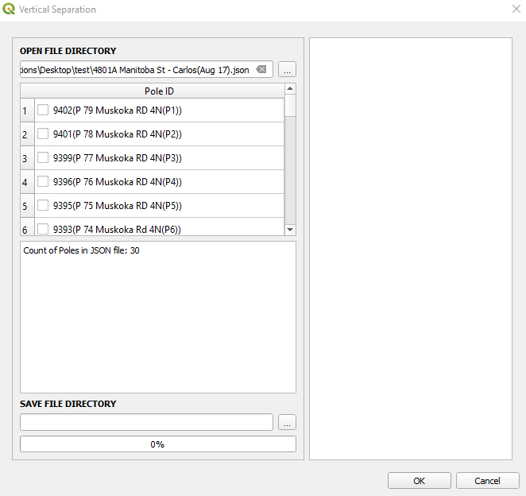
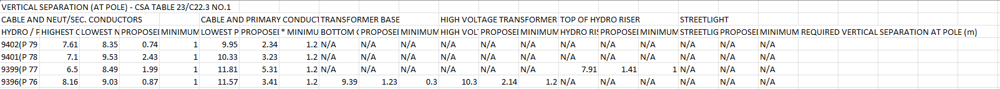

# Bracebridge

## Bracebridge Tracker

The Bracebridge Tracker module 

The following steps will allow you to execute the Bracebridge Tracker functionality:

1. On the VistaCare Communications Plugin go to `Bracebridge --> Bracebridge Tracker`.
2. Fill the following options:

    * FSA Layer: FSA Layer with the database structure.
    * Plans Layer: Plans Layer with the database structure.
    * Cables Layer: Cables Layer with the database structure.
    * Conduit Layer: Conduit Layer with the database structure.
    * Fibre drops Layer: Fibre drops Layer with the database structure.
    * Splices Layer: Splices Layer with the database structure.
    * UG Structures Layer: UG Structures Layer with the database structure.
    * Strands Layer: Strands Layer with the database structure.
    * Anchors Layer: Anchors Layer with the database structure.
    * Poles Layer: Poles Layer with the database structure.
    * Folder for export: Choose the place where the excel file will be exported.

3. Click on `OK` and wait until the module finishes the execution. 

## Pole Profile

IMPORTANT

If output folder location is empty, output files will be save at input json folder location 

SVG 2D image generator for Pole Profile P'Eng Reports.

The following steps will allow you to execute Pole Profile

1. On the VistaCare Plugin go to `Bracebridge --> Pole Profile`.
2. Select the JSON file to work on.
3. Tick the checkbox which pole you want to generate the profile.
4. Fill in Direction column for pole bearing with respect to roadside, default value is 0 degrees.
5. **(Optional)** Choose folder location you want to save your profiles.
6. Click `OK` button to generate the profiles.

 

TIP

1. Bar message will show if wrong JSON file is used (non SpidaCalc json file). Make sure to use SpidaCalc generated JSON file.

 

2. Bar message will show if JSON file has missing layers (`Existing` or `Proposed`) and script will not proceed 

 

3. Bar message will show how many poles have error during populating table information after selecting JSON file(**A**). It will also specify the pole name with its error on the text box (**B**).

 

4. If any pole in the table have error during pole profile creation, it will specify the pole with its error on the text box.

## Vertical Separation

CSV generator for P'Eng Report Exhibit 1 DESIGN DATA Vertical Separation (At Pole) 

The following steps will allow you to execute Vertical Separation

IMPORTANT

If output folder location is empty, output files will be save at input json folder location 

1. On the VistaCare Plugin go to `Bracebridge --> Vertical Separation`.
2. Select the JSON file to work on.
3. Tick the checkbox which pole you want to generate .
4. **(Optional)** Choose folder location you want to save your table.
5. Click `OK` button to generate table

TIP

1. All poles are listed on table and user can select poles for table output.

 

2. Bar message will show if wrong JSON file is used (non SpidaCalc json file). Make sure to use SpidaCalc generated JSON file.

 

3. Bar message will show if `Proposed` layer has an issue and script will not proceed.

 

4. If selected pole was unable to extract information due to an error, it will display the pole and its error in the textbox. A hyperlink of the output will be displayed in the textbox.

  

5. Empty cell is replaced by `N/A`. 

