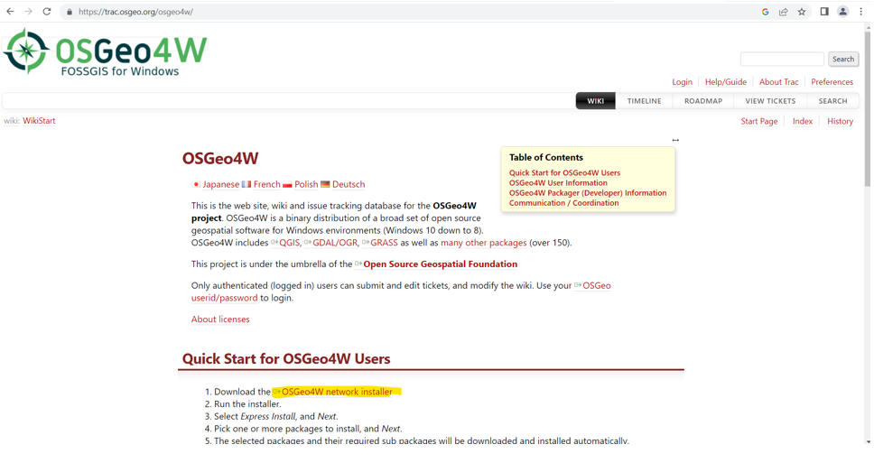
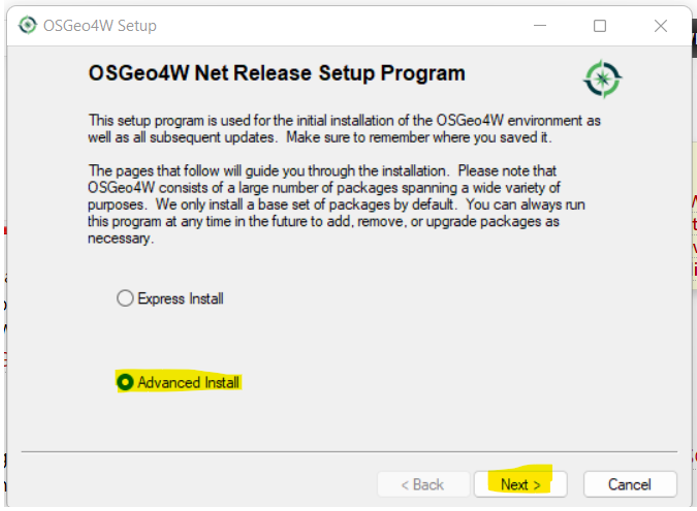
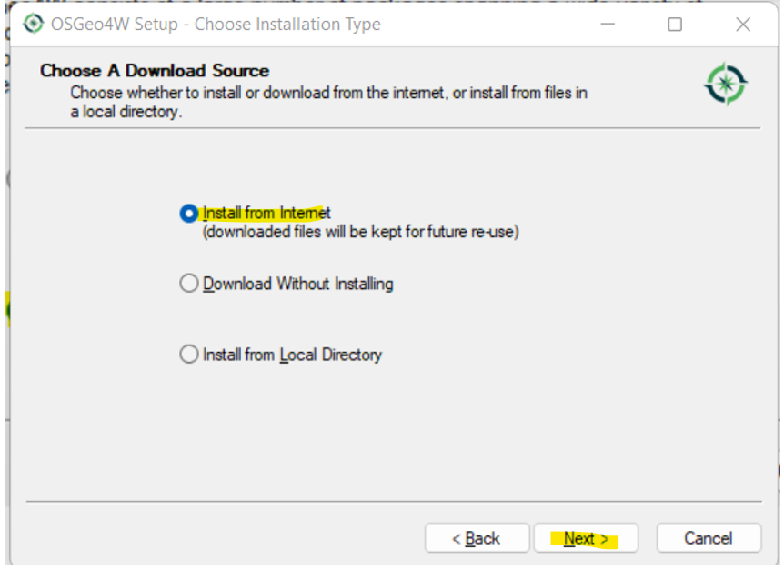
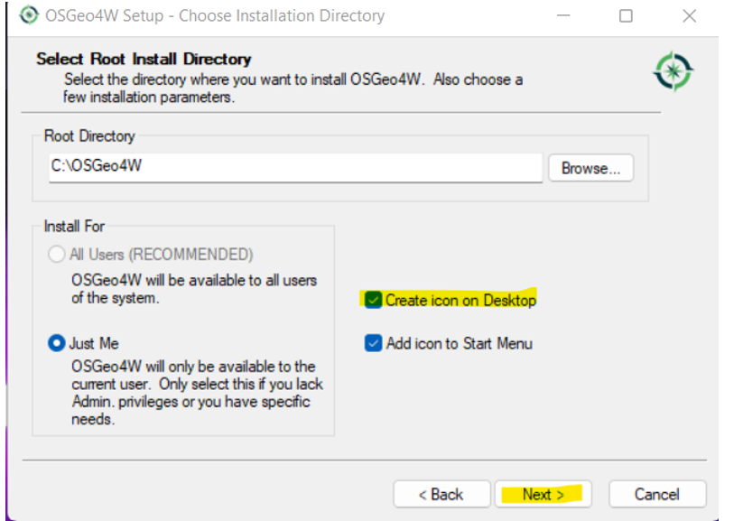
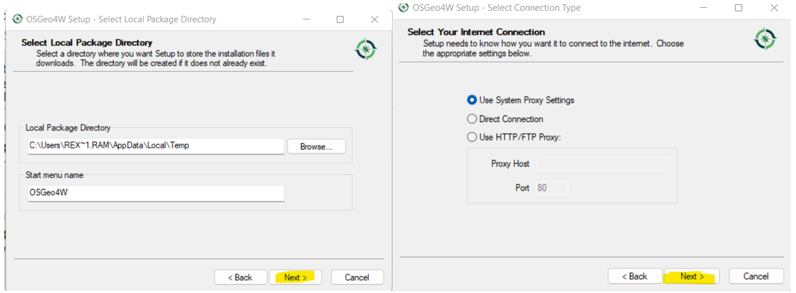
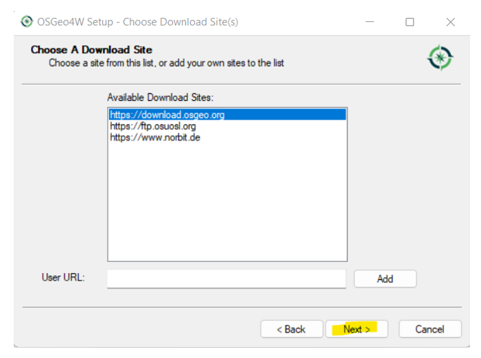
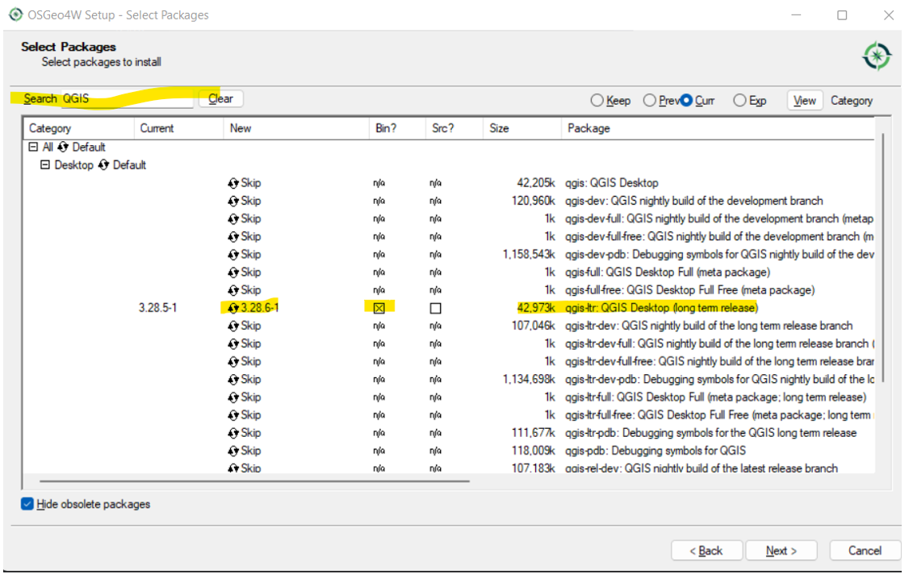
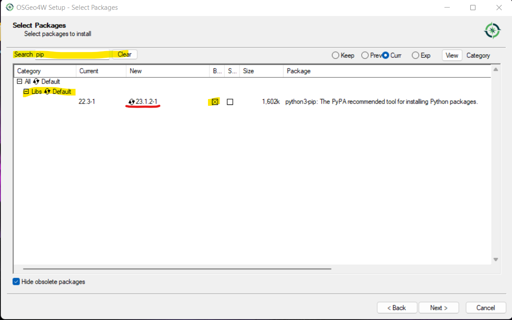

# Configuration

## QGIS Installation

1. Go to <a href="https://trac.osgeo.org/osgeo4w/" target="_blank">OSGeo4W</a> official installer page.
2. Download the OSGeo4W network installer.

    
3. Choose `Advanced Install` then `Next`.

4. Choose `Install from Internet` then `Next`.

5. Click `Create icon on Desktop` then `Next`.

6. Leave as is the setting. Click `Next`.

   
7. On Select Package:

   * Search `QGIS`, look for `qgis-ltr` package as shown in the image. 
   Click the yellow highlighted on <u>New</u> column until <u>3.28</u> appears 
   and make sure column **<u>Bin?</u>** Was crossed out by clicking the tick box. 

   

   * Search `pip`,  look for `python3-pip` package as shown in the image. 
   Click the yellow highlighted on <u>New</u> column until the latest version appears
   and make sure column **<u>Bin?</u>** Was crossed out by clicking the tick box.
   
   
      
   * Click `Next` and QGIS version 3.28 will be installed together with necessary 
   package to run the plugin.

8. To prevent any plugin issues, make sure only QGIS 3.28 version is installed on your system.

## VistaCare Plugin Installation

