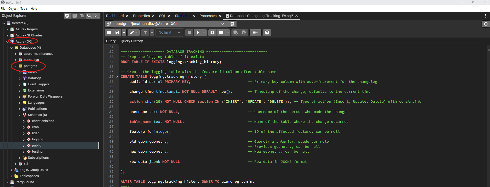

# Database Tracking Documentation 

The development of a tracking system in the database is crucial for maintaining the integrity, security, and traceability of data. This system allows for the recording of all modifications made to database tables, providing a detailed history of each change, including the action performed, the user who carried it out, and the exact time of the change. This information is vital for auditing activities, debugging issues, and recovering data in case of errors or accidental deletions. 

## Database Tracking 


The following steps will allow you to execute the database tracking functionality, On the AZURE - XCI server, specifically on the Postgres database:

<a class="" data-lightbox="QGIS Install" href="_static/Logging_database/Overview_Database.png" title="QGIS Install" data-title="QGIS Install">
</a>

### 1. Creating the Logging Table

 we create the tracking_history table in the logging schema. This table records details of change operations (inserts, updates, and deletes) in other database tables. Each column has a specific purpose:

``` Sql -- Create the logging table with the feature_id column after table_name
CREATE TABLE logging.tracking_history (
    audit_id serial PRIMARY KEY,                         
    change_time timestamptz NOT NULL DEFAULT now(),      
    action char(20) NOT NULL CHECK (action IN ('INSERT', 'UPDATE', 'DELETE')), 
    username text NOT NULL,                               
    table_name text NOT NULL,                            
    feature_id integer,                                   
    old_geom geometry,                                   
    new_geom geometry,                                    
    row_data jsonb NOT NULL                               
); 
```
### 2. Creating the Trigger Function

We define a trigger function that logs changes in the monitored tables. Depending on the type of operation (INSERT, UPDATE, DELETE), the function inserts a record into the tracking_history table with the details of the change:

``` Sql -- Create or replace the trigger function for the changelog
CREATE OR REPLACE FUNCTION logging.tracking_trigger_function()
RETURNS trigger LANGUAGE plpgsql AS $$
BEGIN
    IF TG_OP = 'DELETE' THEN
        INSERT INTO logging.tracking_history (change_time, action, username, table_name, feature_id, row_data, old_geom, new_geom)
        VALUES (now(), 'DELETE', session_user, TG_TABLE_NAME, OLD.id, to_json(OLD), OLD.geom, NULL);
    ELSIF TG_OP = 'INSERT' THEN
        INSERT INTO logging.tracking_history (change_time, action, username, table_name, feature_id, row_data, old_geom, new_geom)
        VALUES (now(), 'INSERT', session_user, TG_TABLE_NAME, NULL, to_json(NEW), NULL, NEW.geom);
    ELSIF TG_OP = 'UPDATE' THEN
        INSERT INTO logging.tracking_history (change_time, action, username, table_name, feature_id, row_data, old_geom, new_geom)
        VALUES (now(), 'UPDATE', session_user, TG_TABLE_NAME, NEW.id, to_json(NEW), OLD.geom, NEW.geom);
    END IF;
    RETURN NULL;
END;
$$;

```
### 3. Creating Triggers for Specific Tables

We create triggers for any target table, so that any insert, update, or delete operation on these tables is recorded in tracking_history.

``` Sql -- Create the trigger for the 'cables_test' table
CREATE TRIGGER tracking_trigger_cables
AFTER INSERT OR UPDATE OR DELETE ON logging.cables_test
FOR EACH ROW EXECUTE FUNCTION logging.tracking_trigger_function();
```
### 4. Checking Results in the Logging Table

To verify the records in the audit table, you can use the following query to order the results by audit_id:

``` Sql -- Check the results in the audit table
SELECT * FROM logging.tracking_history
ORDER BY audit_id ASC;
```


* You can also filter the records by date ranges and username:

``` Sql -- Select by date ranges and users in logging.tracking_history
SELECT *
FROM logging.tracking_history
WHERE change_time BETWEEN '2024-06-07 00:00:00' AND '2024-06-07 23:59:59'
AND username = 'jonathan.diaz';
```


### 5. Recovering Deleted Data

To Recover deleted data in cables_test, select the relevant data from the audit table using the audit_id and reinsert it into the original table.

``` Sql 
-- Recovering deleted data in 'cables_test'
INSERT INTO logging.cables_test (
    id, 
    geom, 
    status, 
    design_state, 
    category, 
    armor_type, 
    cable_type, 
    tether_type, 
    environment_type, 
    duct_size, 
    fiber_capacity, 
    transport_demand, 
    feeder_demand, 
    distribution_demand, 
    spare, 
    total_distribution_demand, 
    total_demand, 
    calc_length, 
    premise_length, 
    start_structure_id, 
    end_structure_id, 
    loopback, 
    wiring_limits, 
    construction_complete, 
    cable_id, 
    peng_visible, 
    placement, 
    terminal_mc
)
SELECT 
    (row_data->>'id')::integer AS id,
    old_geom,
    row_data->>'status' AS status,
    row_data->>'design_state' AS design_state,
    row_data->>'category' AS category,
    row_data->>'armor_type' AS armor_type,
    row_data->>'cable_type' AS cable_type,
    row_data->>'tether_type' AS tether_type,
    row_data->>'environment_type' AS environment_type,
    row_data->>'duct_size' AS duct_size,
    (row_data->>'fiber_capacity')::integer AS fiber_capacity,
    (row_data->>'transport_demand')::integer AS transport_demand,
    (row_data->>'feeder_demand')::integer AS feeder_demand,
    (row_data->>'distribution_demand')::integer AS distribution_demand,
    (row_data->>'spare')::integer AS spare,
    (row_data->>'total_distribution_demand')::integer AS total_distribution_demand,
    (row_data->>'total_demand')::integer AS total_demand,
    (row_data->>'calc_length')::double precision AS calc_length,
    (row_data->>'premise_length')::double precision AS premise_length,
    row_data->>'start_structure_id' AS start_structure_id,
    row_data->>'end_structure_id' AS end_structure_id,
    row_data->>'loopback' AS loopback,
    row_data->>'wiring_limits' AS wiring_limits,
    (row_data->>'construction_complete')::boolean AS construction_complete,
    row_data->>'cable_id' AS cable_id,
    row_data->>'peng_visible' AS peng_visible,
    row_data->>'placement' AS placement,
    row_data->>'terminal_mc' AS terminal_mc
FROM logging.tracking_history
WHERE action = 'DELETE'
AND audit_id = 33 -- this is an example for audit_id
AND table_name = 'cables_test';
```
Video #1

### 6. Recovering Updated Data

To recover updated data in cables_test, select the relevant data from the audit table and insert or update it in the original table using ON CONFLICT.

``` Sql 
--- Recovering updated data in 'cables_test'
WITH selected_record AS (
    SELECT 
        (row_data->>'id')::integer AS id,
        (row_data->>'geom')::geometry AS geom,
        row_data->>'status' AS status,
        row_data->>'design_state' AS design_state,
        row_data->>'category' AS category,
        row_data->>'armor_type' AS armor_type,
        row_data->>'cable_type' AS cable_type,
        row_data->>'tether_type' AS tether_type,
        row_data->>'environment_type' AS environment_type,
        row_data->>'duct_size' AS duct_size,
        (row_data->>'fiber_capacity')::integer AS fiber_capacity,
        (row_data->>'transport_demand')::integer AS transport_demand,
        (row_data->>'feeder_demand')::integer AS feeder_demand,
        (row_data->>'distribution_demand')::integer AS distribution_demand,
        (row_data->>'spare')::integer AS spare,
        (row_data->>'total_distribution_demand')::integer AS total_distribution_demand,
        (row_data->>'total_demand')::integer AS total_demand,
        (row_data->>'calc_length')::double precision AS calc_length,
        (row_data->>'premise_length')::double precision AS premise_length,
        row_data->>'start_structure_id' AS start_structure_id,
        row_data->>'end_structure_id' AS end_structure_id,
        row_data->>'loopback' AS loopback,
        row_data->>'wiring_limits' AS wiring_limits,
        (row_data->>'construction_complete')::boolean AS construction_complete,
        row_data->>'cable_id' AS cable_id,
        row_data->>'peng_visible' AS peng_visible,
        row_data->>'placement' AS placement,
        row_data->>'terminal_mc' AS terminal_mc
    FROM logging.tracking_history
    WHERE audit_id = 35
)
-- Inserting audit_id selected in the 'cables_test' table
INSERT INTO logging.cables_test (
    id, 
    geom, 
    status, 
    design_state, 
    category, 
    armor_type, 
    cable_type, 
    tether_type, 
    environment_type, 
    duct_size, 
    fiber_capacity, 
    transport_demand, 
    feeder_demand, 
    distribution_demand, 
    spare, 
    total_distribution_demand, 
    total_demand, 
    calc_length, 
    premise_length, 
    start_structure_id, 
    end_structure_id, 
    loopback, 
    wiring_limits, 
    construction_complete, 
    cable_id, 
    peng_visible, 
    placement, 
    terminal_mc
)
SELECT 
    id,
    geom,
    status,
    design_state,
    category,
    armor_type,
    cable_type,
    tether_type,
    environment_type,
    duct_size,
    fiber_capacity,
    transport_demand,
    feeder_demand,
    distribution_demand,
    spare,
    total_distribution_demand,
    total_demand,
    calc_length,
    premise_length,
    start_structure_id,
    end_structure_id,
    loopback,
    wiring_limits,
    construction_complete,
    cable_id,
    peng_visible,
    placement,
    terminal_mc
FROM selected_record
ON CONFLICT (id) DO UPDATE
SET 
    geom = EXCLUDED.geom,
    status = EXCLUDED.status,
    design_state = EXCLUDED.design_state,
    category = EXCLUDED.category,
    armor_type = EXCLUDED.armor_type,
    cable_type = EXCLUDED.cable_type,
    tether_type = EXCLUDED.tether_type,
    environment_type = EXCLUDED.environment_type,
    duct_size = EXCLUDED.duct_size,
    fiber_capacity = EXCLUDED.fiber_capacity,
    transport_demand = EXCLUDED.transport_demand,
    feeder_demand = EXCLUDED.feeder_demand,
    distribution_demand = EXCLUDED.distribution_demand,
    spare = EXCLUDED.spare,
    total_distribution_demand = EXCLUDED.total_distribution_demand,
    total_demand = EXCLUDED.total_demand,
    calc_length = EXCLUDED.calc_length,
    premise_length = EXCLUDED.premise_length,
    start_structure_id = EXCLUDED.start_structure_id,
    end_structure_id = EXCLUDED.end_structure_id,
    loopback = EXCLUDED.loopback,
    wiring_limits = EXCLUDED.wiring_limits,
    construction_complete = EXCLUDED.construction_complete,
    cable_id = EXCLUDED.cable_id,
    peng_visible = EXCLUDED.peng_visible,
    placement = EXCLUDED.placement,
    terminal_mc = EXCLUDED.terminal_mc;
```
Video #2

