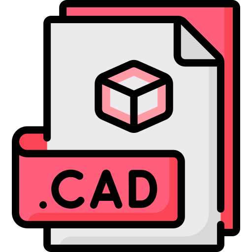
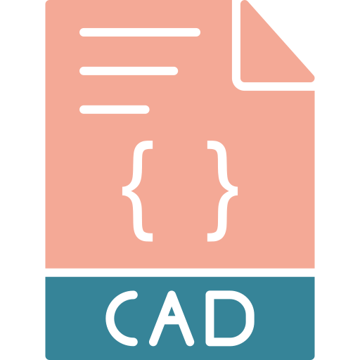
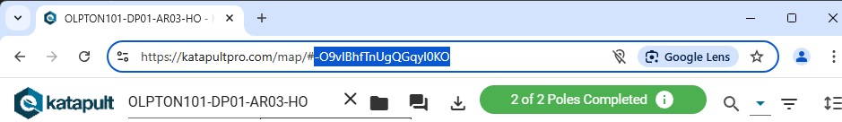
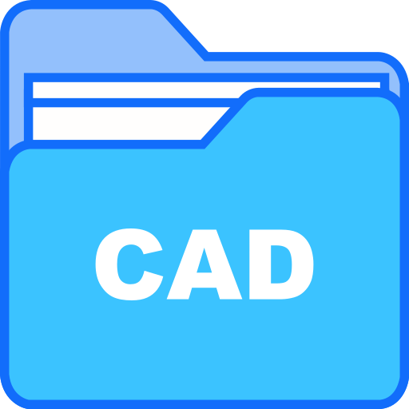
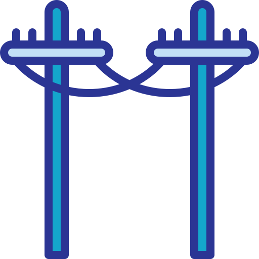
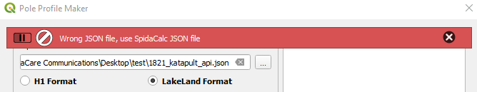
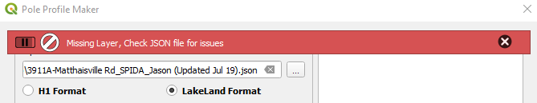
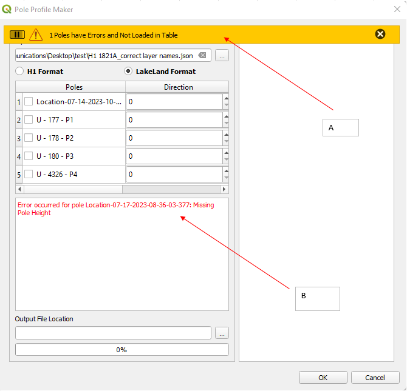
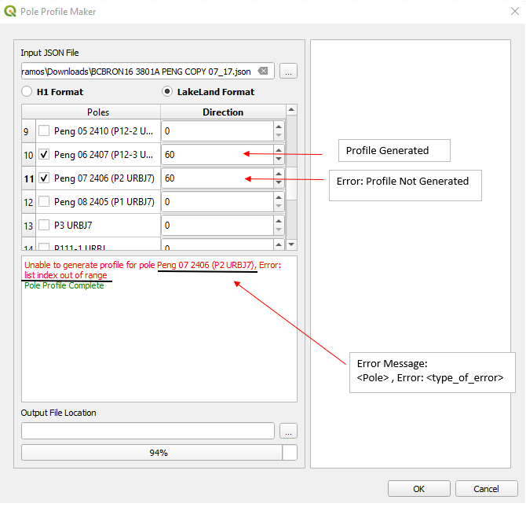

#  CAD

##  CAD Block Export Wizard 

CAD Block Export Wizard is designed to streamline export of GIS information into CAD blocks with attributes and layer. Integrating with UI this gives user the flexibility of handling multiple entities such as Poles, Splice, MPT's, Civic, Cables, etc. This functionality also ensures the CRS are transformed uniformly while using memory data without affecting the original data. 

This development currently support exports for the following entities:
- Pole
- Splice
- MPT
- Cable
- Drop Cable
- Civic
- Underground Structures such as Handhole(GLB), Flowerpot, DIP
- Slack Loop
- Strand
- Conduit
- Span
- Arbs
- Road
- Wiring Limit
- Anchor: including downguy and overhead guy
- Tie in
- CSP
- Plan Page
- FSA Boundary

### How It Works

IMPORTANT

Make sure to run <b>Audit</b> command after export is completed

### NL Project CAD Export Field Names Guide

| **Page**                                                     | **Layer Table to use**        | **Attribute - Field**                                                                                                                                                                                                                                             |
| ------------------------------------------------------------ | ----------------------------- | ----------------------------------------------------------------------------------------------------------------------------------------------------------------------------------------------------------------------------------------------------------------- |
| Poles                                                        | Access Structure Pole Master  | POLE NUMBER - **nlp_bell_id** POLE OWNER - **Owner** POLE AGE - **Age** POLE HEIGHT- **Height** POLE CLASS - **Class**                                                                                                                                |
| Splice                                                       | Splice                        | LABEL - **label_export** PLACEMENT - **placement** CLASS - **class**                                                                                                                                                                                               |
| MPT                                                          | Cables                        | CATEGORY - **category** LABEL - **label** DESIGN STATE - **design_state** FIBER CAPACITY - **fiber_capacity** PLACEMENT - **placement** FINAL LENGTH - **final_length** PREMISE LENGTH - **premise_length**                                     |
| Cable                                                        | cables                        | CABLE DESIGN - **cable_plan_label** PERMIT DESIGN - **label_export** LABEL - **label** ARMOR TYPE - **armor_type** FIBER CAPACITY - **fiber_capacity** PREMISE LENGTH - **premise_length** PLACEMENT - **placement** CATEGORY - **category** |
| Drop Cable                                                   | fibre_drops                   | TYPE - **type** FIBER CAPACITY - **fiber_capacity**                                                                                                                                                                                                            |
| Civic                                                        | \* Drop Layer - Demand Points | PROGRAM - **program** STREET NUMBER - **STREET_NUM** STREET NAME - **STREET_NAM** HOME COUNT - **HOMECOUNT** PLUS CODE - **pluscode**                                                                                                                 |
| Underground Structures: Handhole(GLB), Flowerpot, DIP | UG_structure                  | TYPE - **type** LABEL - **label** STATUS - **status**                                                                                                                                                                                                       |
| Slack Loop                                                   | slack                         | LENGTH - **length** STATUS - **status**                                                                                                                                                                                                                        |
| Strand                                                       | strand                        | STATUS - **status**                                                                                                                                                                                                                                               |
| Conduit                                                      | conduit                       | TYPE - **type** SIZE - **size** STATUS - **status**                                                                                                                                                                                                         |
| Span                                                         | spans                         | CASE - **case** LENGTH - **length**                                                                                                                                                                                                                            |
| Wiring Limit                                                 | wiring_limits                 | HOME PASSED - **homes_passed** FIBER DEMAND - **fiber_demand**                                                                                                                                                                                                 |
| Anchor including guy                                         | anchors                       | STATUS - **status**                                                                                                                                                                                                                                               |
| Tie in                                                       | tie_in                        | LENGTH - **length**                                                                                                                                                                                                                                               |
| CSP                                                          | csp                           | SIZE - **size** STATUS - **status** LABEL - **label_export**                                                                                                                                                                                                |
| Plan Page                                                    | plan_pages_32622              | PAGES - **page**  

##  Katapult Profiles

Similar with **Pole Profiles** and **PAR Profiles**, this module allows the user to generate a CAD format pole profiles using the information from Katapult. The module interface allows the user to choose some or all of poles to be generated. This also has a search bar wherein the user can narrow down the poles from the table.

### How it Works

The following steps will allow you to generate pole profiles using Katapult:
1. In the VistaCare Communications Plugin go to **CAD --> Katapult Profiles**.
2. From browser, copy the Katapult job id and paste it in the line edit. 
   
3. Select the poles to be generated.
4. **(Optional)** Choose folder location you want to save your profiles. Default location is at `C:/Users/{username}/Desktop/{Katapult Job Name}`
5. Click **OK** button to generate the profiles.

##  PAR Profiles

This module, similar to **Pole Profile**, this allows users to generate pole profiles in DXF format, ensuring compatibility with numerous CAD applications. It works exclusively with **SpidaCalc JSON files** containing a single or double pole layer. If the pole has two layer, it will generate poles for both layers and won't do comparison for both layer unlike with **Pole Profiles**.

The plugin performs the following actions:
* Generates a side-by-side image of the selected poles in a single AutoCAD file (named the same as the JSON file)
* Creates individual AutoCAD files for each selected pole (pole label), if two layer exist for the pole it will name as (pole label_layer name)

### How it Works

The following steps will allow you to execute PAR Profile.
1. In the VistaCare Communications Plugin go to **CAD--> PAR Profiles**.
2. Select the **JSON file** to work on.
3. Tick the tickbox which pole you want to generate the profile.
4. Fill in **Direction** column for pole bearing with respect to roadside, default value is 0 degrees.
5. **(Optional)** Choose folder location you want to save your profiles.
6. Click **OK** button to generate the profiles.

TIP

Make sure to open the related QGS project file and select the <b>Poles</b> layer or a related layer from <b>Pole Information Source Layer</b> drop down to capture the table information accurately.

##  Pole Profiles

Image generator for Pole Profile PEng Reports. This plugin lets you create a 2D image for pole profile
in an SVG or DXF format. SVG format gives the user a scalable vector graphic that maintains high quality 
image and can be easily edited with various vector graphic software. DXF format provides compatibility 
with numerous CAD applications.

When selecting both **XCI** and **DXF** formats along with multiple poles, the plugin performs the following actions:
* Generates a side-by-side image of the selected poles in a single AutoCAD file (named the same as the JSON file)
* Creates individual AutoCAD files for each selected pole (named based on the pole label)

### How it Works

The following steps will allow you to execute Pole Profile

1. On the VistaCare Plugin go to **CAD --> Pole Profile**.
2. Select the JSON file to work on.
3. Choose the pole profile format and pole profile file type. 
4. Tick the checkbox which pole you want to generate the profile.
5. Fill in Direction column for pole bearing with respect to roadside, default value is 0 degrees.
6. **(Optional)** Choose folder location you want to save your profiles.
7. Click **OK** button to generate the profiles.

TIP

Make sure to open the related QGS project file and select the <b>Poles</b> layer or a related layer from <b>Pole Information Source Layer</b> drop down to capture the table information accurately.

IMPORTANT

If <b>Output File Location</b> is empty, output files will be save at input json folder location.

 

### Format Summary Table

<!--Markdown Table Generator Data from https://tabletomarkdown.com/generate-markdown-table/ -->
| Display                                                | **H1 Format**                                                                                                                    | **Lakeland Format**                                                         | **XCI Format**                                                              |
| ------------------------------------------------------ | ---------------------------------------------------------------------------------------------------------------------------- | ----------------------------------------------------------------------- | ----------------------------------------------------------------------- |
| Font Color                                             | RED for MR changes on Hydro space Black on Telco space                                                                    | RED for MR changes on Hydro space Black on Telco space               | RED for MR changes on Hydro space Black on Telco space               |
| Primary wires                                          | All wires are drawn                                                                                                          | Lowest primary height is drawn                                          | Lowest primary height is drawn                                          |
| Primary wires with MR                                  | **'PRIM.'** will be in Bold, Red, **Original Value** in Bold, Red then **MR Value** in **'****()****'** ,Bold, Red | 'PRIM.' in Red Original value in Red then MR value in '()', Red   | 'PRIM.' in Red Original value in '()' and Red then MR value in Red   |
| Neutral/Sec wire                                       | All wires are drawn                                                                                                          | All wires are drawn                                                     | All wires are drawn                                                     |
| Neutral/Sec wire with MR                               | **'NEUT./SEC.'** in Bold, Red **Original Value** in Bold, Red **MR value** in **'()'**, Bold, Red          | 'NEUT./SEC.' in Red Original Value in Red MR value in '()', Red   | 'NEUT./SEC.' in  Red Original Value in '()', Red MR value in  Red |
| Proposed guys with Proposed Telco wire              | **'P.BELL/ P.D.G.'** in Bold                                                                                             | **'P.BELL/ P.D.G.'** in Bold                                        | **'P.XPLORE/ D.G.'** in Bold, Blue font color                                  |
| Proposed Telco wire and  proposed guy for represenation | Black Color \**DOT\**                                                                                                          | Black Color \**DOT\**                                                     | Blue Color \**DOT\**                                                      |
| Feature in new heights and Original height          | Original height in normal weight New height in '()' in normal weight                                                      | Original height in normal weight New height in '()' in normal weight | Original height in '()' New height in Normal weight               |
| New Feature height value display                       | **New height** in Bold                                                                                                       | **New height** in Bold                                                  | **New height** in Bold                                                  |
| Feature text display                                   | Display in upper case eg. TRANSF.                                                                                         | Display in upper case eg. TRANSF.                                    | Display in upper case eg. TRANSF.                                    |
| Feature height value display                           | Height Value in normal weight                                                                                                | Height Value in normal weight                                           | Height Value in normal weight                                           |

### Pole Profiles Errors

WARNING

When running the functionality Pole Profiles, it is possible to obtain one of the following messages.

1. Bar message will show if wrong JSON file is used (non SpidaCalc json file). Make sure to use SpidaCalc generated JSON file.

2. Bar message will show if JSON file has missing layers (**Existing** or **Proposed**) and script will not proceed.

3. Bar message will show how many poles have error during populating table information after selecting JSON file(**A**). It will also specify the pole name with its error on the text box (**B**).

4. If any pole in the table have error during pole profile creation, it will specify the pole with its error on the text box.

