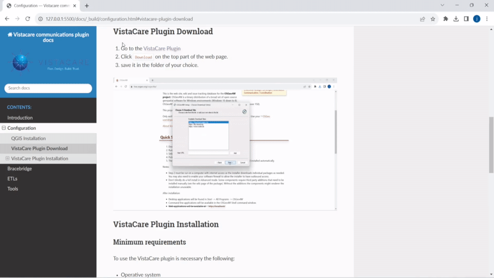
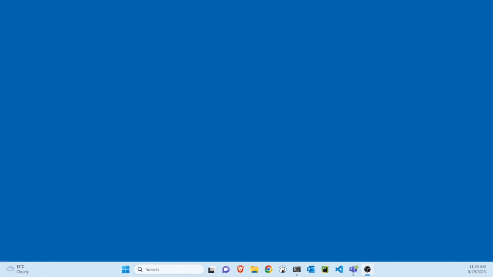

# Configuration

## QGIS Installation

WARNING

To prevent any plugin issues, make sure only QGIS 3.34 version is installed on your system.

1. Go to <a href="https://trac.osgeo.org/osgeo4w/" target="_blank">OSGeo4W</a> official installer page.
2. Download the OSGeo4W network installer.   
3. Choose **Advanced Install** then **Next**.
4. Choose **Install from Internet** then **Next**.
5. Click **Create icon on Desktop** then **Next**.
6. Leave as is the setting. Click **Next**.
7. On Select Package:

   * Search **QGIS**, look for **qgis-ltr** package as shown in the image. 
   Click the yellow highlighted on **New** column until **3.34** appears 
   and make sure column ****Bin?**** Was crossed out by clicking the tick box. 

   * Search **pip**,  look for **python3-pip** package as shown in the image. 
   Click the yellow highlighted on **New** column until the latest version appears
   and make sure column ****Bin?**** Was crossed out by clicking the tick box.
        
   * Click **Next** and QGIS version 3.34 will be installed together with necessary 
   package to run the plugin.

## VistaCare Communications Plugin Download

1. Go to the <a href="https://vistacaretech.sharepoint.com/:u:/s/engineering/ESMc89FC5gVMgCMP3-ZwmcsBqj1ZhxJAaUFBePpcfIIiPA?e=zrSU0V" target="_blank">VistaCare Communications Plugin</a>
2. Click **Download** on the top part of the web page.
3. Save it in the folder of your choice.

## VistaCare Communications Plugin Installation

### Minimum requirements

To use the VistaCare Communications Plugin is necessary the following:

* Operative system

   * Windows 
   * GNU\Linux
   * macOS

* Python libraries

   * openpyxl
   * pycairo
   * jmespath
   * pandas

IMPORTANT

The Python libraries will be installed by the plugin in the administrator mode.

### Installation Process

TIP

It is recommended to use the QGIS version 3.34.

1. Go to the start button and find QGIS.
2. Right Click and choose **Run as administrator**.
3. Click on **Yes** to allow open the app as administrator.  
4. Go in the top bar to **Plugins -> Manage and Install Plugins**.
5. When the Plugins screen appear, choose the option **Install from ZIP** on the right of the interface.
6. Click on the dots **...**, choose the zip file.
7. Finally click on **Install Plugin** and wait until all the process finished.
8. Close the interface and now the VistaCare Communications Plugin is installed.

