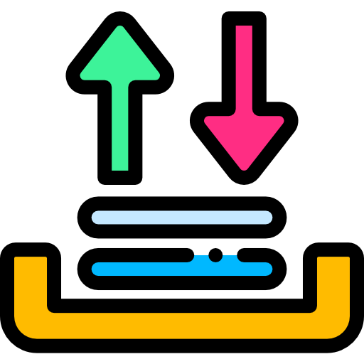
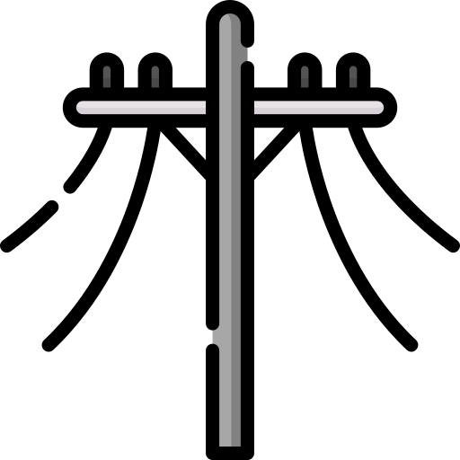
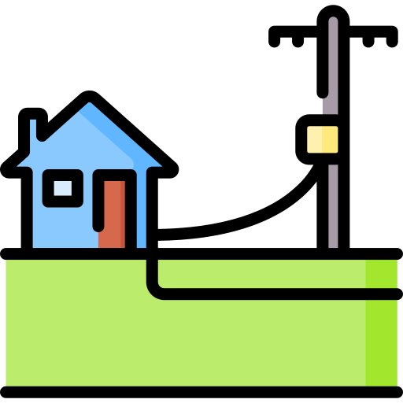
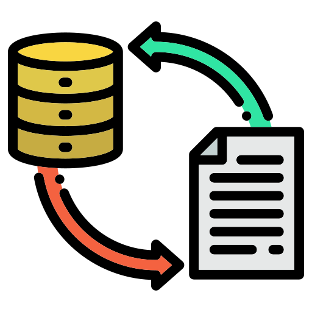

#  ETLs

<!-- THIS DESCRIPTION IS THE PREDECESOR OF ANCHOR SPIDA TO DB DEVELOPMENT. RETAINED FOR FUTURE REFERENCE
## SpidaCalc to DB

SpidaCalc to DB allows us to extract the information from the SpidaCalc JSON file, transform it in the format managed on the database and load it in the Database with the correct format allowing the deleting of the duplicate anchors.

IMPORTANT

The duplicate anchors are defined by two variables, the <b><i>angle space</i></b> between the anchors and the anchors that are in the same <b><i>radius</i></b> that the top vertex of the anchor.

 

The following steps will allow you to execute the SpidaCalc to DB functionality:

1. On the VistaCare Communications Plugin go to `ETLs ==> SpidaCalc To DB`.
2. Fill the following options:

    * Anchor P Eng: Line Layer with the Archor P Eng structure.
    * Poles: A pole layer related to the Anchors.
    * JSON File: File that contains all the anchor information from SpidaCalc.
    * Anchors Angle: Tolerance angle to define possible duplicates.
    * Radius: Tolerance radius to define possible duplicates.

3. Click on `Load Temp Anchor` and wait until the module loads the temporal anchors to be imported.
4. Click on `Next`. 
5. Click on `Load Table` to discover the possible duplicates.
6. Check which are the duplicate anchors and select the `Temp Anchors` or `Anchors` to remove from the database.
7. Click on `Import and Remove Duplicates`.

-->

##  Anchor Spida to DB

The **Anchor Spida to DB** functionality provides a solution for importing and managing anchor, overhed guy and down guy data from SpidaCalc into a GIS database. With features such as layer evaluation, status determination, memory layer visualization, and dynamic user interface components, this tool streamlines the process of visualizing, analyzing, and exporting spatial data from SpidaCalc into QGIS.

### Key Features
1. **Anchor, Overhead and Down Guy Import:** This tool imports anchors, overhead and down guys from SpidaCalc JSON file containing detailed information on poles, anchors, overhead and down guys. It reads and extract pertinent data needed for the functionality.
2. **Memory Layers for Anchor and Poles:** This tool creates a temporary memory layer for poles and anchors. These memory layers are populated with features to allow the spatial visualization of poles, anchors, overhead and down guys within QGIS interface.
3. **Single and Double Layer Evaluation:** This tool supports both single and double layer (existing and proposed )data evaluation.
4. **Anchor and Guys Status Evaluation:** This tool evaluates the status of anchors and guys as 'New' or 'Existing'.
5. **Anchor and Guys Geometry Creation:** This tool automatically generates line geometries for anchor based on pole coordinates, azimuth and lead length. Overhead guys computes and creates a line connecting poles to ensure accurate visual representation.

### How It Works

##  Civics Export

### How It Works

##  Extract and Pack

The Extract and Pack module as the name implies filters the selected layers by the feature in the boundary layer, extracts the information with the methods *intersect* or *within* and packs this data on a specific folder defined by the user.

### How It Works

The following steps will allow you to execute the Extract and Pack functionality:

1. On the VistaCare Communications Plugin go to `Tools --> Extract and Pack`.
2. Fill the following options:

    * Boundary Layer: A Polygon layer with the features will be used as a boundary.
    * Boundary Feature: Define the feature that will be the borders of the information extracted.
    * Layers to Extract: Choose all the layers that are required to be exported.
    * Selection Type: Select one option to match the information (Intersect or Within).
    * Folder for export: Choose the place where they will be located the information extracted.

3. Click on `OK` and wait until the module finishes the execution. 

##  Katapult Importer

The Katapult module allow the user to transfor and load  information from Katapult to the database. this operation is soported for *Poles, Anchors, Civics, Spans*.

### How It Works

The following steps will allow you to execute the Katapult Importer functionality:

1. On the VistaCare Communications Plugin go to `Tools --> Katapult Importer`.
2. Choose the project where you want to import the data.
3. Choose which kind of Layer are you going to import (Anchors example).
4. Fill the options available for each Layer case (Anchors example):

    * Shapefile Anchors: Information extracted from Katapult that contain the Anchors data.
    * Shapefile Guys: Information extracted from Katapult that contain the Guys data.
    * Anchors: Anchors Layer with the database structure.
    * Guys: Guys Layer with the database structure.

3. Click on `Import Data` and wait until the module finishes the execution. 
4. Click on `Finish`.

##  KML Script

### How It Works

##  MR Importer

### How It Works