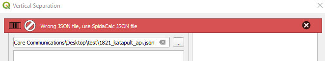
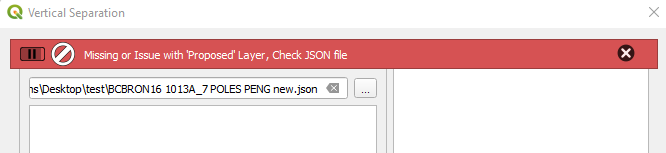
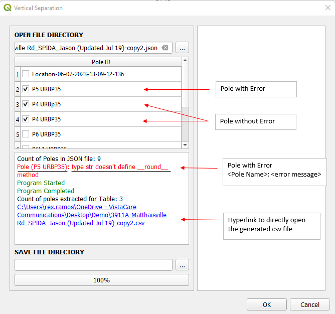

#  PEng

##  Span Clearance and Vertical Separation

CSV generator for PEng Report Exhibit 1 DESIGN DATA Vertical Separation (At Pole) 

### How It Works

The following steps will allow you to execute Vertical Separation:

1. On the VistaCare Plugin go to **PEng --> Span Clearance and Vertical Separation**.
2. Select the JSON file to work on.
3. Tick the checkbox which pole you want to generate .
4. **(Optional)** Choose folder location you want to save your table.
5. Click **OK** button to generate table

IMPORTANT

If <b>Output Folder Location</b> is empty, output files will be save at input json folder location 

### Span Clearance and Vertical Separation Errors

WARNING

When running the functionality Span Clearance and Vertical Separation, it is possible to obtain one of the following messages.

1. Bar message will show if wrong JSON file is used (non SpidaCalc json file). Make sure to use SpidaCalc generated JSON file.

2. Bar message will show if **Proposed** layer has an issue and script will not proceed.

3. If selected pole was unable to extract information due to an error, it will display the pole and its error in the textbox. A hyperlink of the output will be displayed in the textbox.

##  SpidaCalc Validator

Plugin to extract information from SpidaCalc JSON and generate PDF, XLS report for required missing information.

### How It Works

The following steps will allow you to execute the SpidaCalc Validator functionality:

1. On the VistaCare Plugin go to **PEng --> SpidaCalc Validator**.
2. Choose application to validate SpidaCalc JSON file.

    * Pole Profile
    * Anchor Importer (SpidaCalc to DB)
    * Vertical Separation

3. On user interface, select JSON file to work on.
4. **(Optional)** Choose folder location you want to save your reports.
5. Click **OK** button to generate table

TIP

1. Brief Description in Text Box: 
   * Description in 'BLACK' font color are general information
   * Description in 'RED' font color are pole feature missing information
   * Description in 'GREEN' font color are completed reports

2. For **PDF report**, missing information from JSON or any other information source will have its value as **None** and font color to 'RED'.

3. For **XLS report**, missing information from JSON or any other information source will have a value of **None** and its cell font color to 'RED'. Also, if a layer is missing, rest of the row of layer and pole will be empty.

IMPORTANT

All the detailed information can be found in the generated reports.

