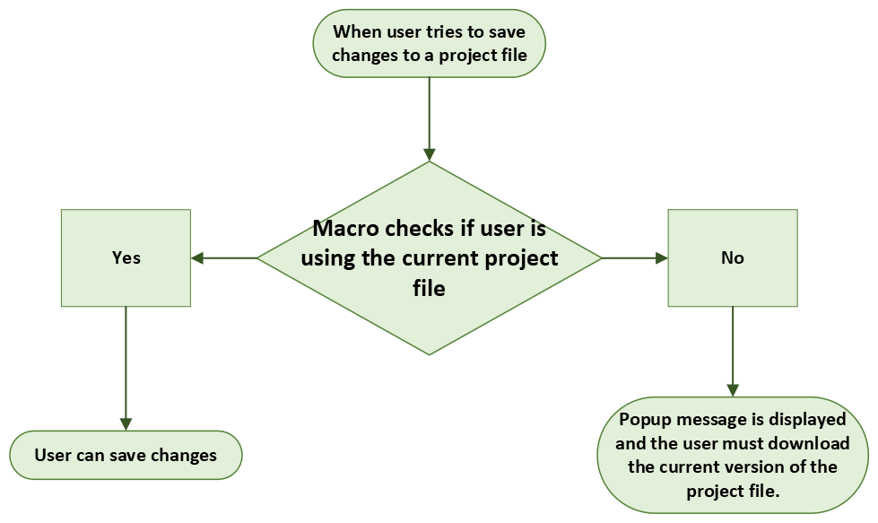

# QGIS Project Files

## Description
Project that aims to prevent the use of outdated versions of QGIS project files.

## How It Works on the User Side
When the user tries to save changes to a project file, a macro that checks whether the user is using the most current version of the project file is executed, and if not, the user is informed through a popup message that they must download the most current version. The user simply needs to click on the link displayed in the popup message and save the project file wherever they want.

 

 
## How It Works on the Administrator Side
For the project to work correctly, the QGIS administrator must save the project files in the <a href="https://vistacaretech.sharepoint.com/sites/engineering/Lists/QGIS%20Project%20Files/AllItems.aspx" target="_blank">QGIS Project Files</a> Sharepoint list and fill in the necessary data. When this is done, the **QGIS Project Files [Automatic]** flow is activated, starting the process that will update the **projects table** in the database with the new project file. This table is used by the macro to check if the user is using the current version of the project file.

 

 

TIP

For more details on how it works, access the documentation for each step in the list below.

## Related Documentation
   ### [QGIS Project Files [Automatic] Flow](../flows/General/QGIS%20Project%20Files%20[Automatic].md)
   ### [qgis_project_files Azure Function](../azure_functions/qgis_project_files.md)